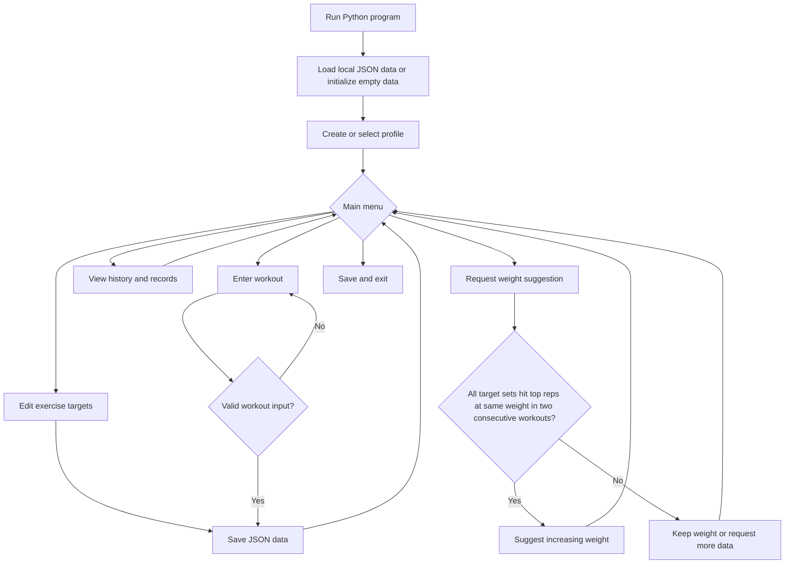

# System Diagram

```mermaid
flowchart TD
    A["Run Python program"] --> B["Load local JSON data or initialize empty data"]
    B --> C["Create or select profile"]
    C --> M{"Main menu"}
    M --> S["Edit exercise targets"]
    M --> L["Enter workout"]
    M --> H["View history and records"]
    M --> P["Request weight suggestion"]
    M --> E["Save and exit"]
    S --> W["Save JSON data"]
    L --> V{"Valid workout input?"}
    V -->|No| L
    V -->|Yes| W
    W --> M
    H --> M
    P --> Q{"All target sets hit top reps at same weight in two consecutive workouts?"}
    Q -->|Yes| I["Suggest increasing weight"]
    Q -->|No| K["Keep weight or request more data"]
    I --> M
    K --> M
```

